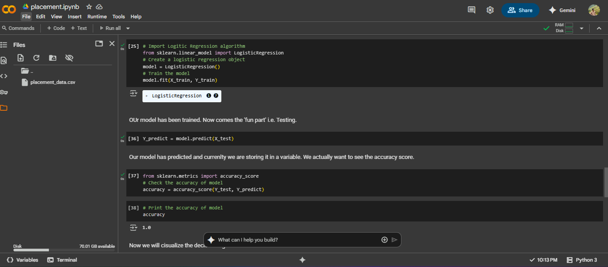
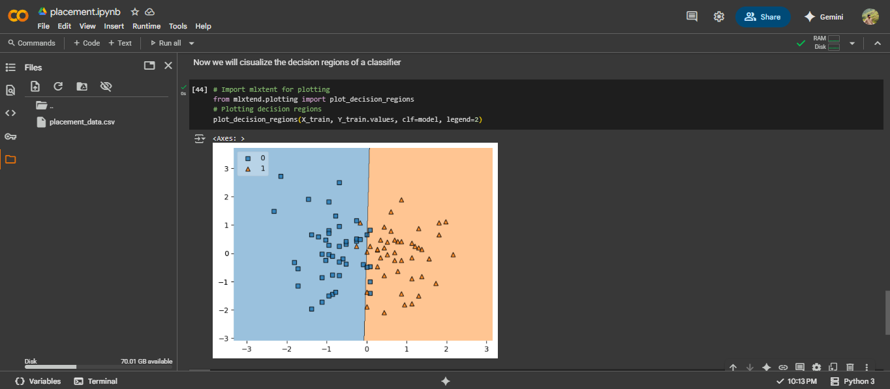

# Placement Prediction ML Model

A machine learning model that predicts whether a person will be placed for a job in a company based on their CGPA and IQ scores.

## Overview

This project implements a logistic regression model to predict job placement outcomes using academic performance (CGPA) and intelligence quotient (IQ) as predictive features. The model follows a complete machine learning pipeline from data preprocessing to visualization of decision boundaries.

## Features

- **Binary Classification**: Predicts placement (Yes/No) based on input features
- **Data Preprocessing**: Handles data cleaning and feature scaling
- **Exploratory Data Analysis**: Visualizes relationships between features
- **Model Evaluation**: Provides accuracy metrics
- **Decision Boundary Visualization**: Shows classifier decision regions

## Dataset

The model expects a CSV file (`placement_data.csv`) with the following structure:
- **CGPA**: Cumulative Grade Point Average (0.0 to 10.0)
- **IQ**: Intelligence Quotient score (typically 0 to 250)
- **Placement**: Target variable (0 = Not placed, 1 = Placed)

*Note: The first column in the dataset is automatically removed as it's considered unnecessary.*

## Requirements

```python
pandas
matplotlib
scikit-learn
mlxtend
```

## Installation

1. Clone or download the project files
2. Install required dependencies:
```bash
pip install pandas matplotlib scikit-learn mlxtend
```
3. Ensure your dataset (`placement_data.csv`) is in the same directory as the script

## Usage

1. **Data Loading and Preprocessing**:
   - Loads the CSV file using pandas
   - Removes the first column (assumed to be unnecessary)
   - Displays dataset information and shape

2. **Exploratory Data Analysis**:
   - Creates scatter plot of CGPA vs IQ with placement outcomes
   - Helps determine the suitability of logistic regression

3. **Model Training**:
   - Splits data into training (90%) and testing (10%) sets
   - Applies StandardScaler for feature normalization
   - Trains a logistic regression model

4. **Model Evaluation**:
   - Makes predictions on test set
   - Calculates and displays accuracy score

5. **Visualization**:
   - Plots decision regions to visualize classifier boundaries

## Model Performance

The model uses logistic regression which is suitable for this dataset because:
- The data shows a linear relationship between features and target
- The scatter plot reveals clear separation between placed and non-placed candidates
- Binary classification problem with linearly separable data

## Key Components

### Data Preprocessing
- **Feature Scaling**: StandardScaler normalizes CGPA (0-10 range) and IQ (0-250 range) to comparable scales
- **Train-Test Split**: 90% training, 10% testing split

### Model Architecture
- **Algorithm**: Logistic Regression
- **Features**: CGPA and IQ scores
- **Output**: Binary classification (0 = Not placed, 1 = Placed)

### Visualization
- **Scatter Plot**: Shows feature relationships and placement outcomes
- **Decision Regions**: Visualizes classifier decision boundaries using mlxtend

## File Structure

```
placement_prediction/
├── placement.py          # Main script
├── placement_data.csv    # Dataset (not included)
└── README.md            # This file
```

## Example Output

The model will display:
- Dataset information and shape
- Scatter plot of CGPA vs IQ with placement colors
- Model accuracy score
- Decision region visualization

## Limitations

- Model assumes linear relationship between features and placement
- Limited to two features (CGPA and IQ)
- Small test set (10%) may not provide robust evaluation
- No cross-validation implemented

## Demonstration


---


